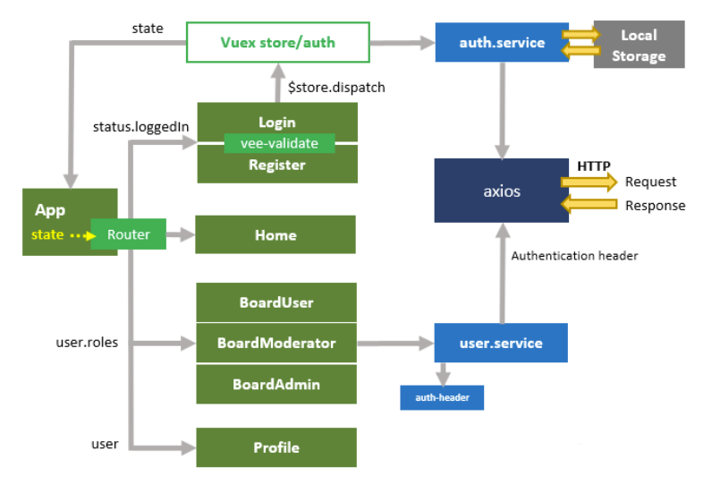
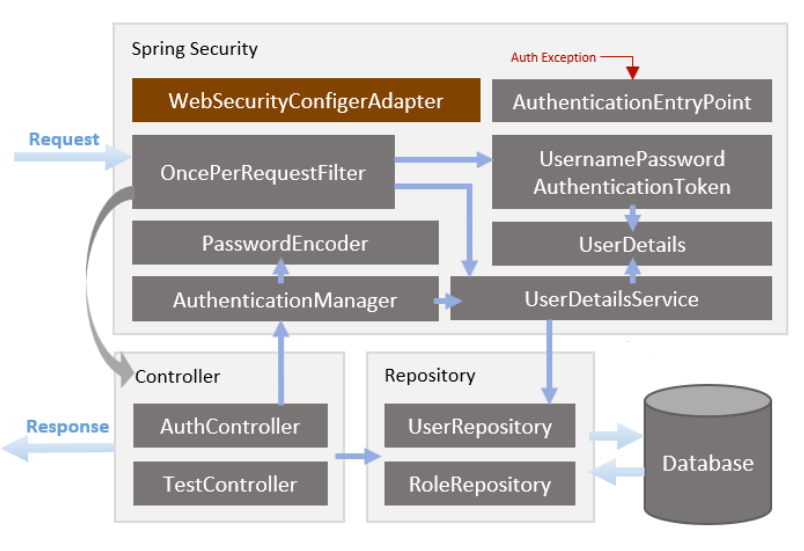

# P2P

## Running the project in docker environement

1. Make sure docker is well intalled in your machine
2. go to "docker/" repository
3. open your terminal and run the following commands : 

    ```
    $ docker compose build
    ```
    then
    ```
    & docke compose up
    ```

4. once the two commandes are done being processed, open your fav. browser and go to **localhost:8081**
    
## Front overview


## Back overview


