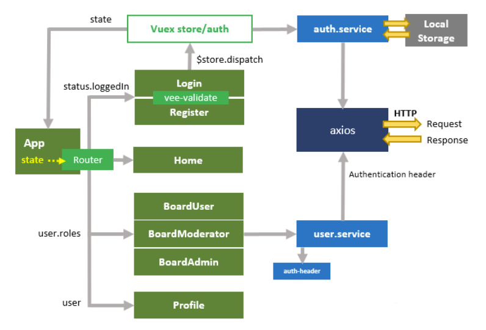
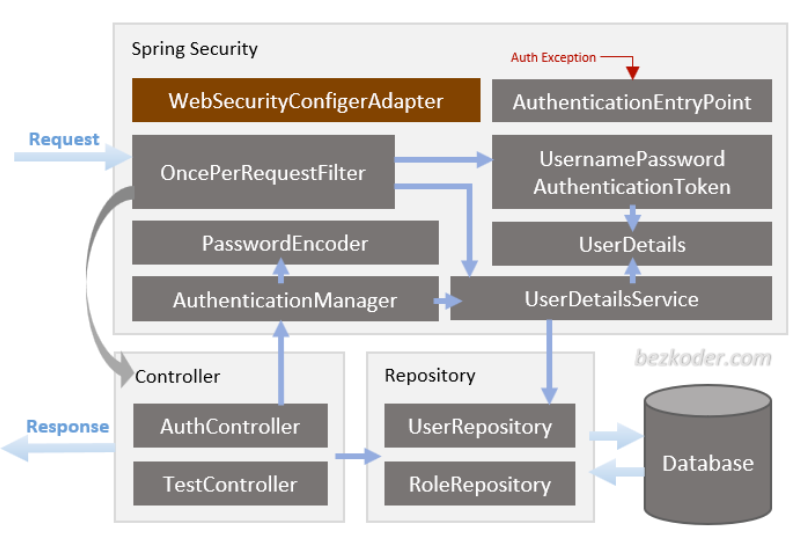

# Pay2Play

## Concepte

vu le gros nombre de follower sur twitch, il y a forcement un nombre qui aura envie de jouer avec son streamer préféré !

Le but est de mettre en lien ces deux dernier avec un système payant automatiser, et en tirer une commission avec un systeme de session.

Le système de session est un systeme qui permettra a un follower de choisir son streamer en fonction du prix, dispo .. etc (a développer)

[TODO -> ajouter + de def] 

## BDD

### tables 
* user
    * global info :
        * id_user
        * username
        * nickename
        * email
        * pw
        * linked to twitch or discord (a voir comment c'est gere ce truc)
        * id_session dont ce user est contribuer 
        * nb_de_session deja effectuée

                
    * user 1 (streamer)   
                    comment retirer les info de twitch ? (api ??) pense pas ca donne acces a l'info des users ou ptetre dans un premier temps le user renseigne un nombre approximative de ses followers ??
                    nb_followers
                    
    * user 2 (follower)

    * user 3 (admin)

                   
        
* Session
    * id session
    * duration
    * price
    * game
    * id du user 1 (streamer) [1->1]
    * id du user 2 (follower) [1->1]
    * type de session (en cours, non validé, annulé, supprimé.. etc) pour garder l'etat actuelle des sessions dans le cas du non finition de l'usage, où on lui permettra d'écrire se remettre sur le formulaire de ces session son tout retaper

## Maquette

* home page with all the stuff (contact about etc..)
login page
* a page for followers with a list of streamers filtred with prices, games, disponibilities.. etc
* une page pour les follower pour "creer une nouvelle session" (garder)
* contact us 
* about us
    
## Front overview

## Back overview

